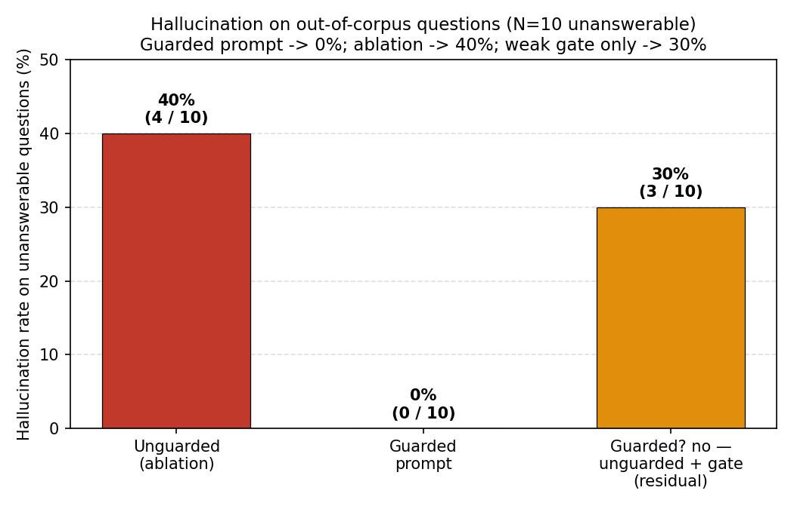
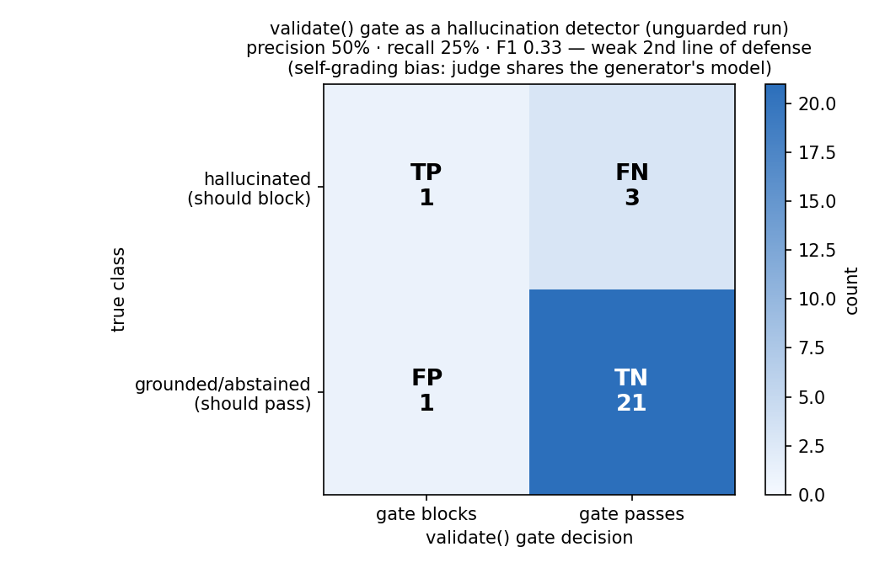

# NIM Agent Blueprint — Agentic RAG on the NVIDIA Stack

A reference architecture for an **agentic RAG** application built on **NVIDIA NIM**
microservices (LLM + embedding + reranker) with a **planning → retrieval → validation**
agent loop and a built-in **evaluation + observability** harness.

A self-contained blueprint that can be cloned, pointed at any NIMs, and adapted. It
implements a multi-agent / hybrid-retrieval pipeline on the NVIDIA-native serving stack.

## What this is
- A runnable agentic RAG app: NIM LLM for generation, hybrid (dense+keyword) retrieval with an
  optional **NIM reranker** second stage, and an agent layer (plan / retrieve / generate /
  **validate**) over them.
- A **NIM-agnostic provider layer** — swap a hosted `build.nvidia.com` endpoint for a self-hosted NIM
  by changing one env var.
- An **eval harness**: retrieval hit-rate, answer groundedness (LLM-as-judge), latency — so the
  blueprint ships with the numbers an SA would show a partner.
- OpenTelemetry tracing so each agent step is observable.

## What this is NOT
- Not a NIM reimplementation — it consumes NIM HTTP endpoints (hosted or self-hosted).
- Not tied to one framework — the agent loop is plain Python; a NeMo Agent Toolkit variant is in `app/nat_variant/` (roadmap).
- Not a demo that hides the hard parts — retrieval quality and groundedness are measured, not asserted.

## Architecture
```
            ┌─────────────── Agent loop (plan → retrieve → generate → validate) ───────────────┐
 query ───▶ │  planner ─▶ hybrid retriever ─▶ generator ─▶ validator (groundedness + safety)   │ ─▶ answer
            └──────┬──────────────┬───────────────┬───────────────────┬─────────────────────────┘
                   │              │               │                   │
              NIM LLM       NIM embedding    NIM LLM            NIM LLM (judge)
            (reasoning)   (+ NIM rerank,     (answer)          + rule checks
                            opt-in)
```

## Layout
```
app/provider.py     # NIM provider: hosted (build.nvidia.com) or self-hosted, one switch
app/retriever.py    # hybrid retrieval: dense + keyword (min-max fused) -> optional NIM rerank (NIM_RERANK=1)
app/agent.py        # plan -> retrieve -> generate -> validate loop, OTel-traced
app/serve.py        # FastAPI entrypoint
eval/dataset.jsonl  # small grounded-QA eval set (seed questions + gold passages)
eval/run_eval.py    # retrieval hit-rate, groundedness (LLM-judge), latency -> eval/report.md
deploy/compose.yml  # self-host NIMs (LLM + embed + rerank) + the app
docs/design-decisions.md
docs/roadmap.md
```

## Quick start
```bash
# Option A — hosted NIMs (fastest): set an NGC key, no GPU needed for the app itself
export NIM_MODE=hosted NVIDIA_API_KEY=nvapi-...
pip install -r requirements.txt
python app/serve.py            # POST /ask {"q": "..."}

# Option B — self-hosted NIMs on your H100s / RTX Pro 6000
export NIM_MODE=selfhost
docker compose -f deploy/compose.yml up -d
python eval/run_eval.py        # -> eval/report.md
```

## Results — self-hosted on a single H100 (vLLM Qwen3-8B + Ollama embeddings)

_Hardware: one H100, on a 4× H100 box — the 8B model fits on a single GPU, so only one is used (the others are untouched)._

Full writeup: [`eval/report.md`](eval/report.md). NIM is OpenAI-compatible, so a self-hosted
vLLM endpoint is a faithful stand-in — flip `NIM_MODE`/`NIM_LLM_URL` to a real
`build.nvidia.com` or self-hosted NIM and the harness is unchanged. Corpus: 20 passages;
eval: 16 answerable + 10 unanswerable (incl. **adversarial near-miss** — B200/H200/FP4
questions the model is tempted to answer from the H100 facts in context).

| metric | value |
|---|---|
| retrieval recall@3 | 100% (16/16 — small illustrative set; near-trivial retrieval at 20-passage corpus, k=3) |
| answer accuracy (answerable) | 100% (16/16 — same small illustrative set, N=26 total; not a statistical benchmark) |
| hallucination on unanswerable — **guarded** prompt | **0%** (0/10) |
| hallucination on unanswerable — **unguarded** (ablation) | **40%** (4/10) |

*(N=26 — illustrative, not a statistical benchmark; see the caveat in `eval/report.md`.)*

**Guarded prompting drives hallucination to 0% on out-of-corpus questions; removing it (ablation) sends the same model to 40%, and the weak `validate()` gate alone only claws it back to 30% (illustrative N=10 unanswerable set):**



**The `validate()` LLM-as-judge gate is a weak second line of defense — precision 50%, recall 25%, F1 0.33 (caught 1 of 4 hallucinations); the judge shares the generator's model/endpoint, so it has a self-grading bias (small illustrative N=26):**



**The honest finding:** a guarded generator prompt drives hallucination to 0% on
out-of-corpus questions; *removing* it (ablation) sends the same model to 40%. The
`validate()` LLM-as-judge gate, scored as a hallucination detector on the unguarded run,
is only a **weak second line of defense — recall 25%, F1 0.33** (caught 1 of 4
hallucinations), cutting residual 40%→30%. The judge shares the generator's model and
endpoint, so this groundedness check has a self-grading bias (the model is asked to flag its
own output) — a likely contributor to the low 25% gate recall. A single-pass judge is not
enough on its own; this is why the roadmap adds a multi-sample / NeMo-Guardrails validator. Per-answer cost is
~2 extra LLM calls (plan + validate) — the price of a self-checking agent.

> Run it yourself (self-hosted): `NIM_MODE=selfhost NIM_LLM_URL=…:8011/v1
> NIM_EMBED_URL=…:11434/v1 NIM_DISABLE_THINKING=1 python eval/run_eval.py`.
> LLM served on GPU 2 only — the busy GPU 0 is never touched.

## Talk

This repo doubles as the supplementary material for a talk,
**"Agentic RAG That Doesn't Hallucinate: Guardrails & Evaluation on the NVIDIA Stack."**

- [`talk/slides.md`](talk/slides.md) — the deck (Marp; `marp talk/slides.md -o slides.pdf`), with speaker notes.
- [`talk/walkthrough.md`](talk/walkthrough.md) — reproduce the guarded-vs-unguarded ablation in ~5 min.
- [`talk/README.md`](talk/README.md) — abstract, format, and audience.

## References
- [NVIDIA NIM](https://build.nvidia.com/) — the microservices this blueprint consumes.
- [NVIDIA/NeMo-Agent-Toolkit](https://github.com/NVIDIA/NeMo-Agent-Toolkit) — the toolkit the `nat_variant` targets.

## Disclaimer
Personal project for learning. Views and results are my own and do not represent any employer.

---

_See [waynehacking8.github.io](https://waynehacking8.github.io/). Writeup: [0% vs 50%: making a RAG agent refuse to hallucinate](https://waynehacking8.github.io/blog/rag-groundedness-guardrail/)._
