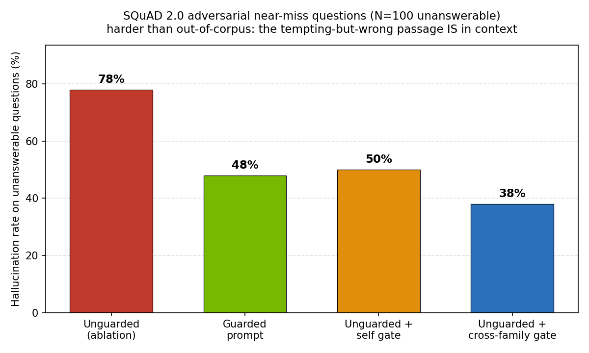
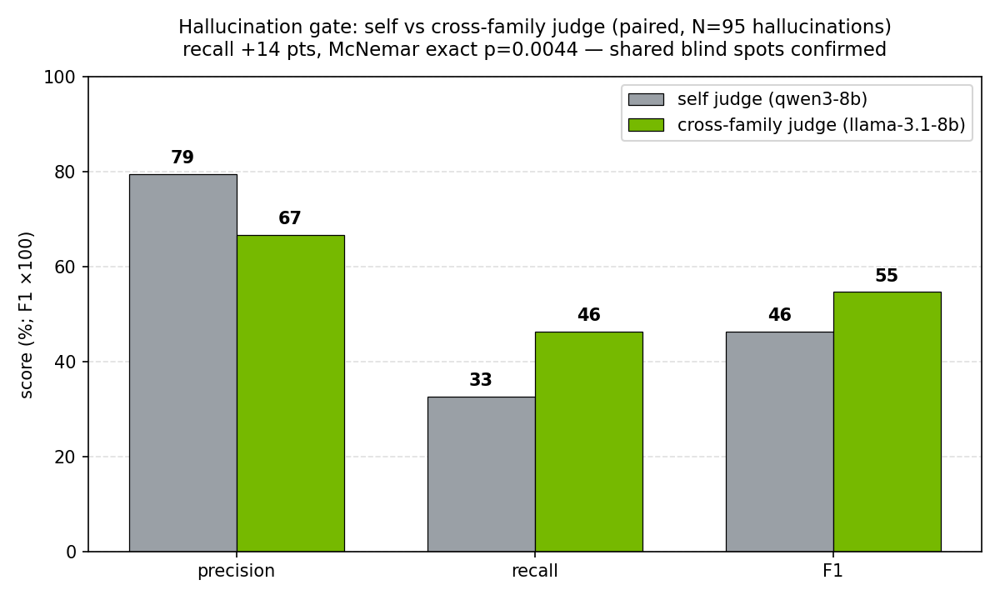
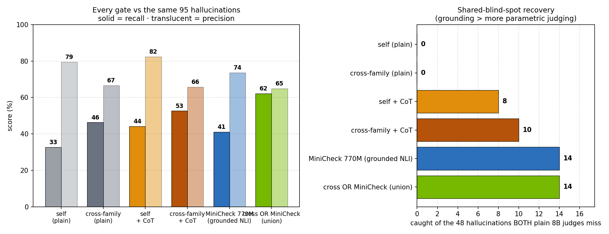
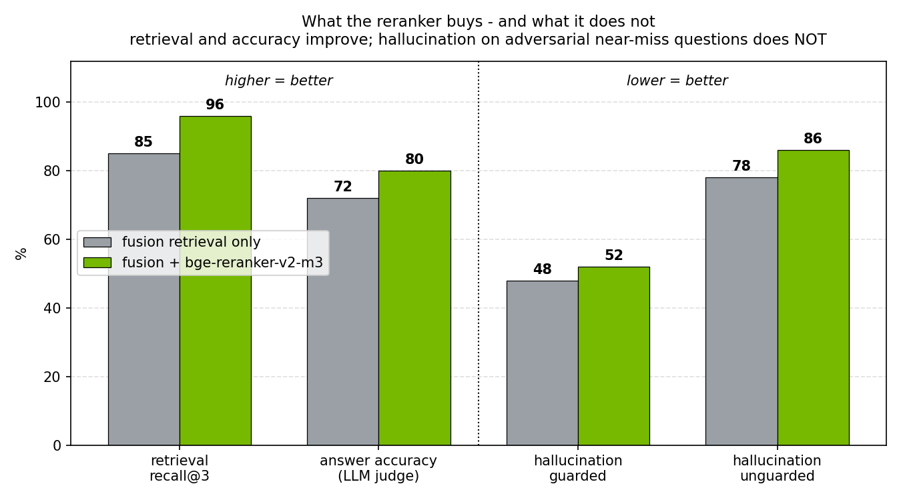
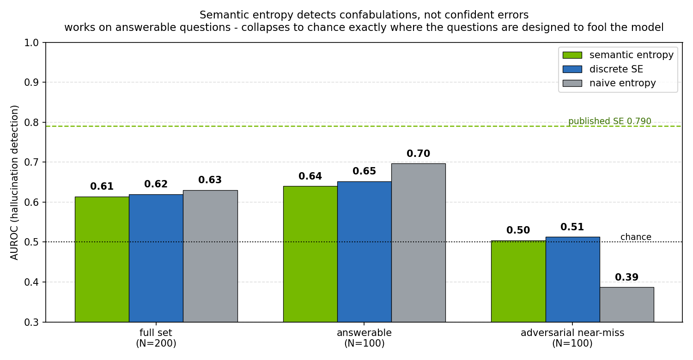

# NIM Agent Blueprint — Agentic RAG on the NVIDIA Stack

A reference architecture for an **agentic RAG** application built on **NVIDIA NIM**
microservices (LLM + embedding + reranker) with a **planning → retrieval → validation**
agent loop and a built-in **evaluation + observability** harness.

A self-contained blueprint that can be cloned, pointed at any NIMs, and adapted. It
implements a multi-agent / hybrid-retrieval pipeline on the NVIDIA-native serving stack.

## What this is
- A runnable agentic RAG app: NIM LLM for generation, hybrid (dense+keyword) retrieval with an
  optional **NIM reranker** second stage, and an agent layer (plan / retrieve / generate /
  **validate**) over them.
- A **NIM-agnostic provider layer** — swap a hosted `build.nvidia.com` endpoint for a self-hosted NIM
  by changing one env var.
- An **eval harness**: retrieval hit-rate, answer groundedness (LLM-as-judge), latency — so the
  blueprint ships with the numbers an SA would show a partner.
- OpenTelemetry tracing so each agent step is observable.

## What this is NOT
- Not a NIM reimplementation — it consumes NIM HTTP endpoints (hosted or self-hosted).
- Not tied to one framework — the agent loop is plain Python; a NeMo Agent Toolkit variant is in `app/nat_variant/` (roadmap).
- Not a demo that hides the hard parts — retrieval quality and groundedness are measured, not asserted.

## Architecture
```
            ┌─────────────── Agent loop (plan → retrieve → generate → validate) ───────────────┐
 query ───▶ │  planner ─▶ hybrid retriever ─▶ generator ─▶ validator (groundedness + safety)   │ ─▶ answer
            └──────┬──────────────┬───────────────┬───────────────────┬─────────────────────────┘
                   │              │               │                   │
              NIM LLM       NIM embedding    NIM LLM            NIM LLM (judge)
            (reasoning)   (+ NIM rerank,     (answer)          + rule checks
                            opt-in)
```

## Layout
```
app/provider.py     # NIM provider: hosted (build.nvidia.com) or self-hosted, one switch
app/retriever.py    # hybrid retrieval: dense + keyword (min-max fused) -> optional NIM rerank (NIM_RERANK=1)
app/agent.py        # plan -> retrieve -> generate -> validate loop, OTel-traced
app/serve.py        # FastAPI entrypoint
eval/dataset.jsonl  # small grounded-QA eval set (seed questions + gold passages)
eval/run_eval.py    # retrieval hit-rate, groundedness (LLM-judge), latency -> eval/report.md
deploy/compose.yml  # self-host NIMs (LLM + embed + rerank) + the app
docs/design-decisions.md
docs/roadmap.md
```

## Quick start
```bash
# Option A — hosted NIMs (fastest): set an NGC key, no GPU needed for the app itself
export NIM_MODE=hosted NVIDIA_API_KEY=nvapi-...
pip install -r requirements.txt
python app/serve.py            # POST /ask {"q": "..."}

# Option B — self-hosted NIMs on your H100s / RTX Pro 6000
export NIM_MODE=selfhost
docker compose -f deploy/compose.yml up -d
python eval/run_eval.py        # -> eval/report.md
```

## Results — self-hosted on a single H100 (vLLM Qwen3-8B + Ollama embeddings)

_Hardware: a single H100 — the 8B model fits comfortably on one GPU._

Full writeup: [`eval/report.md`](eval/report.md). NIM is OpenAI-compatible, so a self-hosted
vLLM endpoint is a faithful stand-in — flip `NIM_MODE`/`NIM_LLM_URL` to a real
`build.nvidia.com` or self-hosted NIM and the harness is unchanged. Corpus: 20 passages;
eval: 16 answerable + 10 unanswerable (incl. **adversarial near-miss** — B200/H200/FP4
questions the model is tempted to answer from the H100 facts in context).

| metric | value |
|---|---|
| retrieval recall@3 | 100% (16/16 — small illustrative set; near-trivial retrieval at 20-passage corpus, k=3) |
| answer accuracy (answerable) | 100% (16/16 — same small illustrative set, N=26 total; not a statistical benchmark) |
| hallucination on unanswerable — **guarded** prompt | **0%** (0/10) |
| hallucination on unanswerable — **unguarded** (ablation) | **40%** (4/10) |

*(N=26 — illustrative, not a statistical benchmark; see the caveat in `eval/report.md`.)*

**Guarded prompting drives hallucination to 0% on out-of-corpus questions; removing it (ablation) sends the same model to 40%, and the weak `validate()` gate alone only claws it back to 30% (illustrative N=10 unanswerable set):**


**The `validate()` LLM-as-judge gate is a weak second line of defense — precision 50%, recall 25%, F1 0.33 (caught 1 of 4 hallucinations). This ~25% recall is consistent with published self-detection findings (arXiv:2511.11087 reports ~22% recall without chain-of-thought); the primary mechanism is shared blind spots — the judge is the same model and lacks the same knowledge whose absence caused the hallucination (small illustrative N=26):**


**The honest finding:** a guarded generator prompt drives hallucination to 0% on
out-of-corpus questions; *removing* it (ablation) sends the same model to 40%. The
`validate()` LLM-as-judge gate, scored as a hallucination detector on the unguarded run,
is only a **weak second line of defense — recall 25%, F1 0.33** (caught 1 of 4
hallucinations), cutting residual 40%→30%. That ~25% recall is consistent with published
self-detection findings: arXiv:2511.11087 reports ~22% self-detection recall without
chain-of-thought (rising to 58% with CoT), almost exactly our number. The **primary
mechanism is shared blind spots** — the model hallucinated *because* it lacked the
knowledge (these are out-of-corpus B200/H200/FP4 facts), and the judge, being the same
model, still lacks that knowledge, so it cannot detect the error. **Self-preference bias**
(the model favoring its own low-perplexity text, per Panickssery et al., NeurIPS 2024) is a
secondary contributor. Because the dominant cause is missing knowledge, prompt-level fixes
*cannot* close this gap. The roadmap mitigations target the mechanism directly: an
**independent judge model** from a different model family, a **panel of diverse judges**
(PoLL), or **retrieval-grounded verification** (give the judge the retrieved context to
check claims against — already natural for RAG), plus **CoT judging** as a cheap partial
improvement (~22%→58% per arXiv:2511.11087, but only where the knowledge exists). Per-answer
cost is ~2 extra LLM calls (plan + validate) — the price of a self-checking agent.

> Run it yourself (self-hosted): `NIM_MODE=selfhost NIM_LLM_URL=…:8011/v1
> NIM_EMBED_URL=…:11434/v1 NIM_DISABLE_THINKING=1 python eval/run_eval.py`.

## Results at scale — SQuAD 2.0, N=200, with confidence intervals

The demo set above shows the harness works; it cannot support statistics (its own caveat).
This run can: **100 SQuAD 2.0 dev passages, 100 answerable + 100 unanswerable questions**
(SQuAD 2.0's unanswerable questions are crowdworker-written **adversarial near-misses** — the
on-topic paragraph IS retrieved into context, it just doesn't contain the answer — a strictly
harder test than out-of-corpus questions). Built deterministically by
`eval/build_squad_eval.py`; full report with Wilson CIs:
[`eval/report_squad.md`](eval/report_squad.md).

| metric | value (95% CI) |
|---|---|
| retrieval recall@3 | 85% [77–91%] |
| answer accuracy — substring | 70% [60–78%] |
| answer accuracy — LLM judge | 72% [63–80%] |
| hallucination, **guarded** generator | **48%** [38–58%] |
| hallucination, **unguarded** generator | **78%** [69–85%] |

(Re-run end-to-end for the Phase 5 experiments below — every number reproduces the previous
round within 1–2 points at temp=0, which is itself a useful determinism check.)

Two findings that change the story the demo set told:

**1. The guarded prompt is much weaker against near-miss questions.** On out-of-corpus
questions (demo set) it achieved 0%; on SQuAD's adversarial near-misses it only cuts 79%→49%.
When a tempting-but-wrong passage is *in* the context, "answer only from context" actively
backfires — the model grounds a wrong answer in the near-miss passage. Guardrails must be
evaluated against the hard case, not the easy one.



**2. The cross-family judge experiment (the roadmap's shared-blind-spots test) — supported,
with statistics.** The same unguarded answers were scored by two judges: the generator itself
(qwen3-8b) and an independent judge from a different model family (llama-3.1-8b), serving on a
separate GPU. Paired comparison, exact McNemar test:

| judge | precision | recall | F1 | residual hallucination |
|---|---|---|---|---|
| self (qwen3-8b) | 79% | 33% [24–43%] | 0.46 | 50% |
| **cross-family (llama-3.1-8b)** | 67% | **46%** [37–56%] | **0.55** | **38%** |

Recall **+14 points (p = 0.0044, McNemar exact)** — of hallucinations caught by exactly one
judge, the cross-family judge caught 16 vs the self judge's 3. This supports the
shared-blind-spots attribution on this setup (single dataset, one 8B judge pair — see
[`eval/report_squad.md`](eval/report_squad.md) for the robustness check and limitations) and
matches the cross-model detection literature (FINCH-ZK, arXiv:2508.14314: detection F1
improved by 6–39% on FELM from cross-model consistency). The trade-off is real too: the
independent judge is stricter (precision 79%→67%, more false blocks).

The honest residual: **48 of 95 hallucinations were caught by neither 8B judge** — two small
judges still share most blind spots with each other. The next rungs (larger judge, judge
panel/PoLL, retrieval-grounded verification) target exactly that — measured below.



> Reproduce: `python3 eval/build_squad_eval.py` then
> `NIM_MODE=selfhost NIM_LLM_URL=…:8011/v1 NIM_LLM_MODEL=qwen3-8b
> NIM_EMBED_URL=…:11434/v1 NIM_EMBED_MODEL=nomic-embed-text NIM_DISABLE_THINKING=1
> NIM_XJUDGE_MODEL=llama-3.1-8b NIM_XJUDGE_URL=…:8013/v1
> EVAL_CORPUS=corpus_squad.jsonl EVAL_DATASET=dataset_squad.jsonl EVAL_REPORT=report_squad.md
> python3 eval/run_eval.py` (generator and judge on separate GPUs).

## Attacking the 48 shared blind spots — every method class the literature offers

The 48-of-95 result above is the repo's central open problem: hallucinations that escape
*both* 8B generative judges. This round runs each published method class against the **same
200 rows / same answers** (temp=0 ⇒ all comparisons paired, exact McNemar):

| gate | precision | recall | F1 | catches of the 48 blind spots |
|---|---|---|---|---|
| self judge (plain) | 79% | 33% | 0.46 | 0 (by definition) |
| cross-family judge (plain) | 67% | 46% | 0.55 | 0 (by definition) |
| self + CoT (arXiv:2511.11087) | 82% | 44% | 0.58 | 8 |
| cross-family + CoT | 66% | 53% | 0.58 | 10 |
| MiniCheck-FT5 770M, grounded NLI (arXiv:2404.10774) | 74% | 41% | 0.53 | **14** |
| **cross-family OR MiniCheck (union)** | 65% | **62%** | **0.63** | 14 |



Four findings ([`eval/report_judge_variants.md`](eval/report_judge_variants.md)):

1. **CoT judging works and is free** — one prompt change lifts self-judge recall 33%→44%
   (p=0.035) *and* improves precision. The published 22%→58% gain doesn't fully materialize on
   adversarial near-miss material, but the direction and significance hold.
2. **A 770M grounded verifier catches what 8B parametric judges cannot.** MiniCheck's overall
   recall (41%) sits between the two 8B judges, but it recovers **14 of the 48 shared blind
   spots** — more than any judge variant — because it checks the answer against the retrieved
   evidence instead of judging from its own (absent) knowledge. The bottleneck is grounding,
   not capacity.
3. **The deployable answer is the union**: generative judge OR grounded NLI = 62% recall,
   F1 0.63 — the two methods catch *different* hallucinations.
4. **23 of 95 hallucinations still escape everything.** That is the new floor.

### Does better retrieval reduce hallucination? (NIM reranker, NV-RerankQA arXiv:2409.07691)

Re-ran the full eval with a cross-encoder reranking stage (`NIM_RERANK=1`; bge-reranker-v2-m3,
since NVIDIA's NV-RerankQA checkpoint is license-gated). Paired per question
([`eval/report_rerank.md`](eval/report_rerank.md)):

| metric | fusion only | + reranker | delta | p |
|---|---|---|---|---|
| retrieval recall@3 | 85% | **96%** | +11 pts | 0.0010 |
| answer accuracy (LLM judge) | 72% | 80% | +8 pts | 0.0386 |
| hallucination (guarded) | 48% | 52% | +4 pts | n.s. |
| hallucination (unguarded) | 78% | 86% | +8 pts | n.s. |

The published-scale retrieval gain (+11 vs the paper's +14) is real and carries to accuracy —
but it does **not** reduce hallucination on the adversarial case. Better retrieval surfaces
more on-topic context for questions that have no answer in the corpus, and on-topic-but-
answerless context does not make the generator abstain more. **Retrieval quality and
hallucination safety are different axes.**



### Can the generator's own uncertainty flag hallucinations? (Semantic entropy, Nature 2024)

10 samples per question at T=1.0, DeBERTa-MNLI bidirectional-entailment clustering, AUROC
against the same hallucination labels ([`eval/report_semantic_entropy.md`](eval/report_semantic_entropy.md)):

| slice | semantic entropy | naive entropy | published |
|---|---|---|---|
| full set (N=200) | 0.61 | 0.63 | 0.79 / 0.69 |
| answerable only | 0.64 | **0.70** | — |
| **adversarial near-miss** | **0.50 (chance)** | 0.39 (inverted) | — |

The published signal reproduces in direction on answerable questions (naive entropy 0.70 vs
published 0.69) and **collapses to chance exactly where it would be needed most**. Semantic
entropy detects *confabulations* — arbitrary wrong answers from an uncertain model. SQuAD 2.0's
near-miss questions induce *systematic* errors: the model confidently gives the same wrong
answer in most samples. Farquhar et al. scope this out explicitly; this measures how much that
scoping matters: the repo's central blind-spot set is made of exactly the errors sampling-based
uncertainty cannot see.



## Talk

This repo doubles as the supplementary material for a talk,
**"Agentic RAG That Doesn't Hallucinate: Guardrails & Evaluation on the NVIDIA Stack."**

- [`talk/slides.md`](talk/slides.md) — the deck (Marp; `marp talk/slides.md -o slides.pdf`), with speaker notes.
- [`talk/walkthrough.md`](talk/walkthrough.md) — reproduce the guarded-vs-unguarded ablation in ~5 min.
- [`talk/README.md`](talk/README.md) — abstract, format, and audience.

## References
- [NVIDIA NIM](https://build.nvidia.com/) — the microservices this blueprint consumes.
- [NVIDIA/NeMo-Agent-Toolkit](https://github.com/NVIDIA/NeMo-Agent-Toolkit) — the toolkit the `nat_variant` targets.
- [Can LLMs Detect Their Own Hallucinations?](https://arxiv.org/abs/2511.11087) — ~22% self-detection recall without CoT (58% with CoT); the shared-blind-spot finding behind our gate-recall attribution.
- [LLM Evaluators Recognize and Favor Their Own Generations (NeurIPS 2024)](https://arxiv.org/abs/2404.13076) — self-preference bias in LLM-as-judge.
- [Replacing Judges with Juries (PoLL)](https://arxiv.org/abs/2404.18796) — a panel of diverse judges beats a single large judge at lower cost.
- [SelfCheckGPT (EMNLP 2023)](https://arxiv.org/abs/2303.08896) — sampling-based hallucination detection without external resources.
- [FINCH-ZK: Zero-knowledge LLM hallucination detection through fine-grained cross-model consistency](https://arxiv.org/abs/2508.14314) — cross-model checking improves detection F1 by 6–39% (FELM); the literature anchor for the cross-family-judge result.
- [SQuAD 2.0 (Rajpurkar et al., ACL 2018)](https://arxiv.org/abs/1806.03822) — the adversarial-unanswerable QA dataset behind the N=200 eval.

## Disclaimer
Personal project for learning. Views and results are my own and do not represent any employer.

---

_See [waynehacking8.github.io](https://waynehacking8.github.io/). Writeup: [0% vs 50%: making a RAG agent refuse to hallucinate](https://waynehacking8.github.io/blog/rag-groundedness-guardrail/)._
